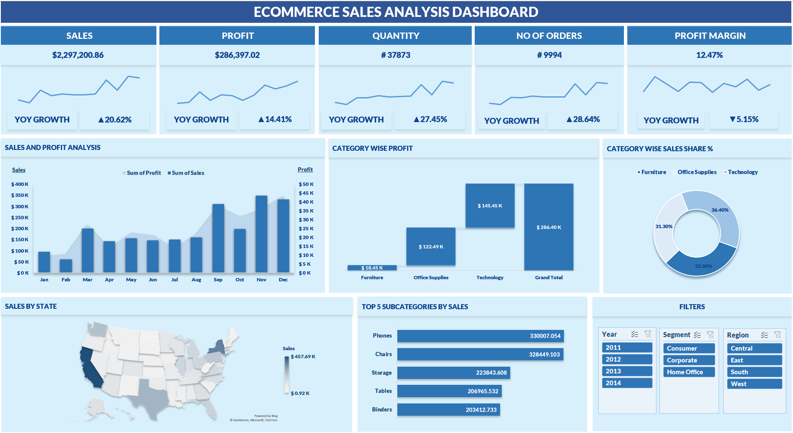

# Ecommerce Sales Analysis Dashboard

## Project Overview
This project involves a comprehensive analysis of ecommerce sales data to track key performance indicators (KPIs) and visualize business trends. The goal was to provide actionable insights into profitability, regional sales distribution, and year-over-year (YOY) growth.

## Key Features
- **Dynamic KPIs:** Real-time tracking of Total Sales ($2.3M+), Profit ($286K+), Quantity, and Profit Margin.
- **Interactive Slicers:** Users can filter data by **Year**, **Segment**, and **Region**.
- **YOY Analysis:** Automatic calculation of Year-over-Year growth percentages for all core metrics.
- **Geospatial Mapping:** Visualization of sales distribution across US states.
- **Product Insights:** Comparison of sales and profit across categories (Technology, Furniture, Office Supplies).

## Technical Skills Used
* **Data Cleaning:** Handled missing values and standardized data formats in Excel.
* **Pivot Tables:** Built complex pivot tables to aggregate data by month, category, and state.
* **Advanced Formulas:** Used `CALCULATE`-style logic in Excel to determine YOY growth.
* **Data Visualization:** Designed a clean, business-ready interface with custom formatting and charts.

## How to Use
1. Download the `Ecommerce_Sales_Dashboard.xlsx` file.
2. Open it in Microsoft Excel (Enable Macros/Content if prompted).
3. Use the slicers on the left to interact with the data.

---
*Created by [Your Name] as part of a Data Analytics Portfolio.*
